### **1\. Configuración inicial del servidor**

**Cambia el nombre del equipo a: srv-ad01**  
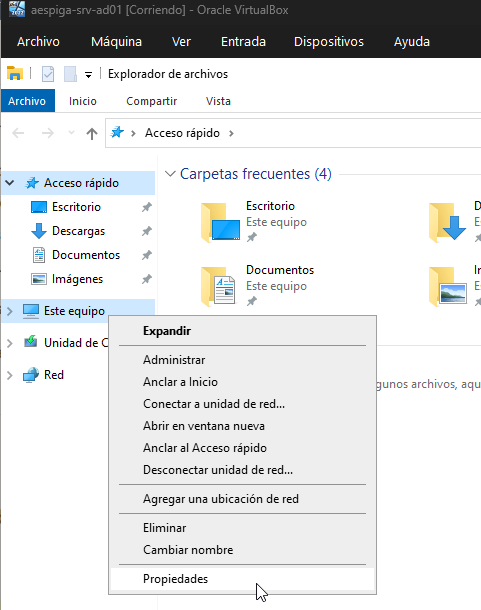  
Abrimos el explorador de archivos, le damos clic derecho en este equipo y propiedades.  
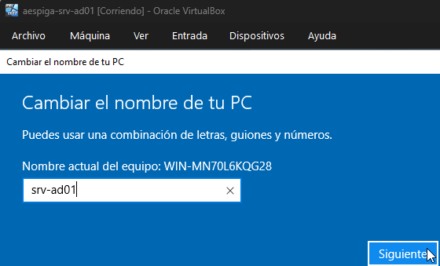  
Le damos a Cambiar nombre de este equipo y le ponemos el nombre.  

**Reinicia el sistema.**  
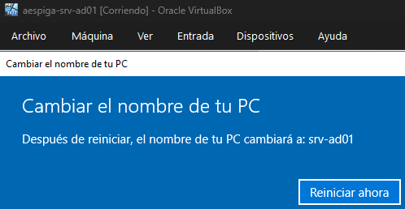  
Cuando nos lo pida reiniciamos la máquina.  

**Comprueba el nombre del equipo ejecutando: hostname**  
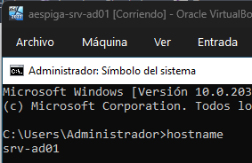  
Esta máquina actuará como controlador de dominio, su función principal es permitir la autenticación centralizada, permitiendo que un usuario inicie sesión en cualquier equipo de la red con una única cuenta y permisos controlados. [Documentación oficial](https://learn.microsoft.com/es-es/windows-server/identity/ad-ds/get-started/virtual-dc/active-directory-domain-services-overview).  

### **2\. Instalación del rol Active Directory Domain Services**

**Abre Server Manager.**  
**Selecciona: Add Roles and Features**  
**Instala el rol: Active Directory Domain Services**  
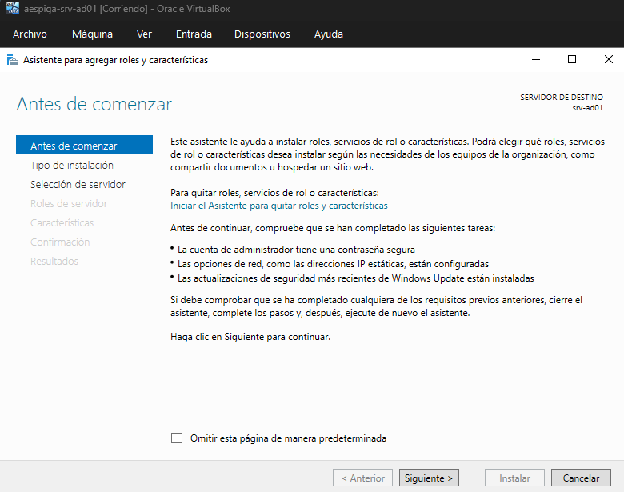  
Al seleccionar añadir roles y características sale esta ventana que explica como funciona.  
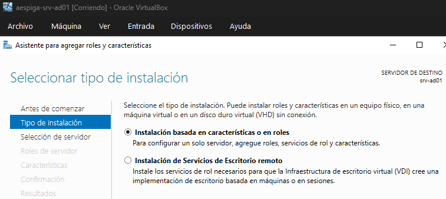  
Seleccionamos la primera opción porque queremos instalar un rol.  
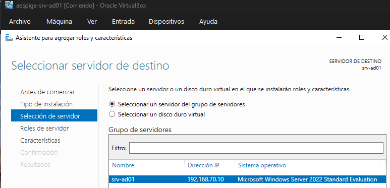  
Aquí seleccionamos el servidor.  
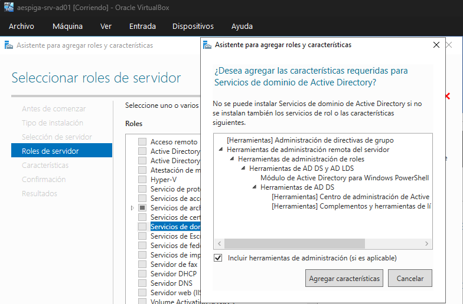  
Seleccionamos el rol Active Directory Domain Services con sus características.  
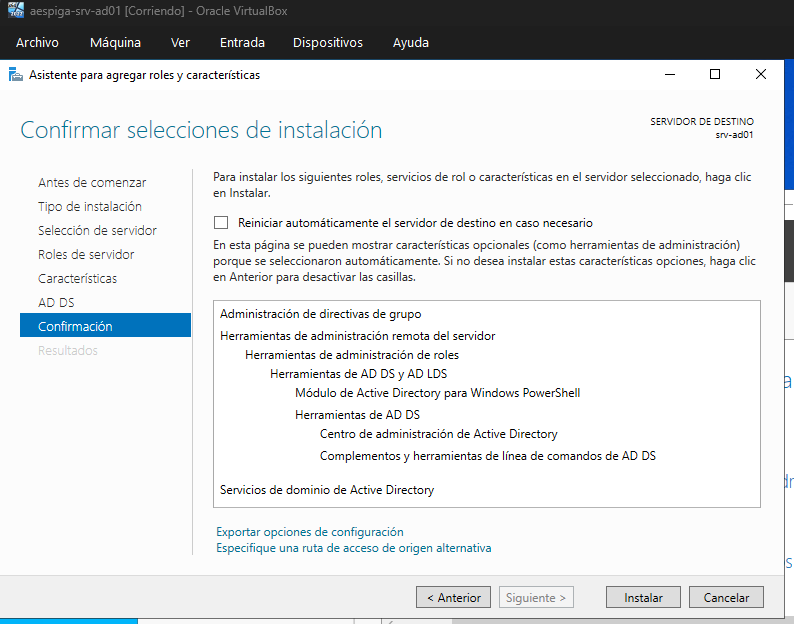  
Aquí tan solo confirmamos la instalación del rol y le damos a instalar.  
La función principal es permitir de Active Directory Domain Services es la autenticación centralizada, permitiendo que un usuario inicie sesión en cualquier equipo de la red con una única cuenta y permisos controlados. [Documentación oficial](https://learn.microsoft.com/es-es/windows-server/identity/ad-ds/get-started/virtual-dc/active-directory-domain-services-overview).  

### **3\. Promoción del servidor a controlador de dominio**

**Una vez instalado el rol, selecciona: Promote this server to a domain controller**  
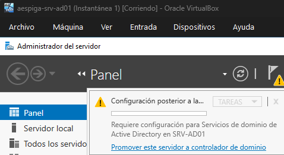  
En el Administrador del servidor seleccionamos Promover este servidor a controlador de dominio.  
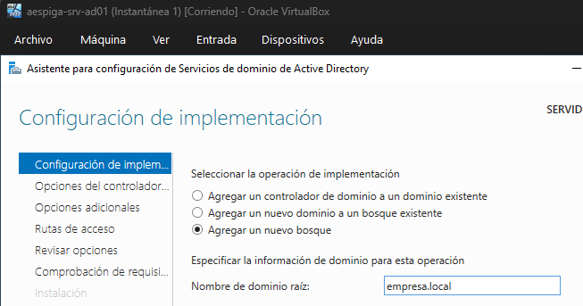  
En esta ventana seleccionamos agregar un nuevo bosque ya que no tenemos ningún dominio existente y le ponemos el nombre del dominio principal.  
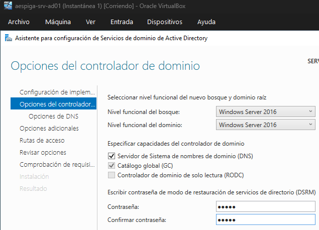  
Elegimos el nivel de funcionalidad y ponemos la contraseña.  
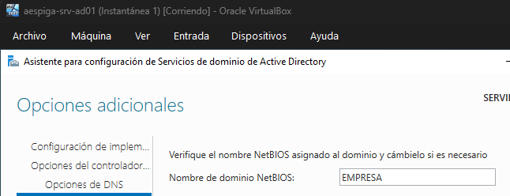  
Dejamos por defecto el nombre que detecte el sistema.  
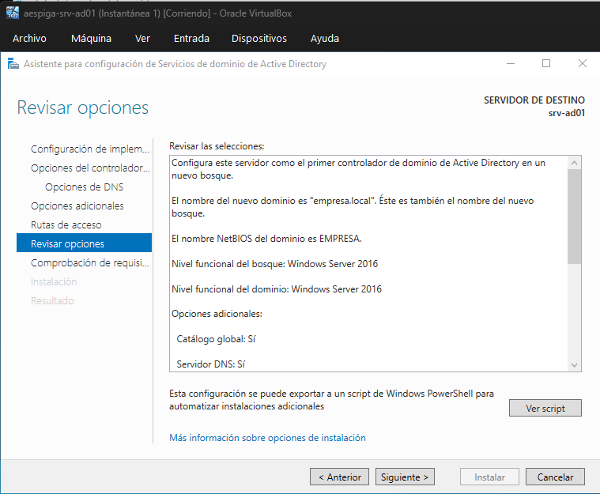  
Este es el resumen de lo seleccionado.  
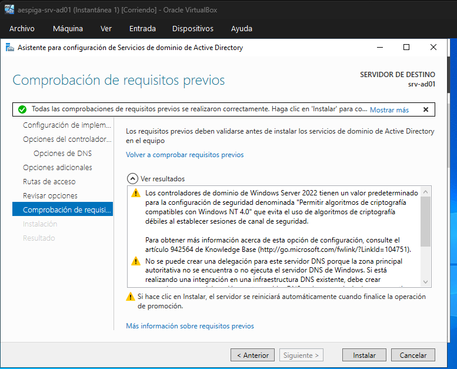  
Y ahora ya solo queda pinchar en instalar.  
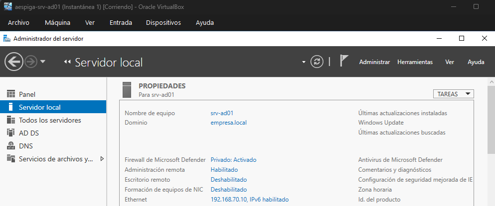  
Convertir una máquina en controlador de dominio implica que el servidor deja de ser una máquina aislada para convertirse en la que autentifica a todos los miembros de la red (usuarios y equipos). [Documentación oficial](https://learn.microsoft.com/es-es/windows-server/identity/ad-ds/get-started/virtual-dc/active-directory-domain-services-overview).  

### **4\. Verificación del dominio**

**Tras el reinicio, inicia sesión con la cuenta: empresa\Administrator**  
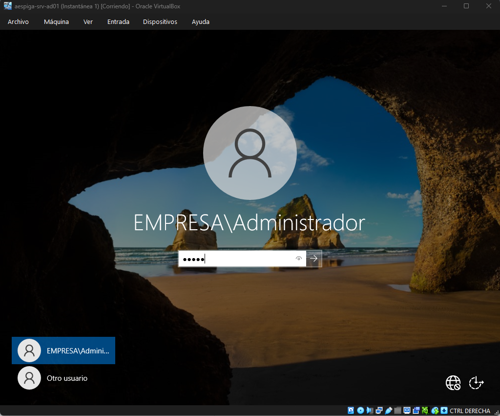  

**Abre la herramienta: Active Directory Users and Computers**  
**Comprueba que aparece el dominio: empresa.local**  
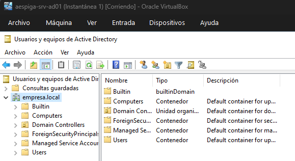  

Dominio (empresa.local): Es el contenedor raíz que engloba a todos los objetos del dominio.  
Builtin: Contiene los grupos de seguridad predefinidos de Windows (como Administradores o Usuarios de escritorio remoto).  
Computers: Es la carpeta por defecto donde aparecerán los equipos que pertenezcan al dominio.  
Domain Controllers: Aquí se ve el nombre del servidor actual.  
Users: Es el almacén donde se crean las cuentas de usuario y los grupos de usuarios.  

### **5\. Creación de usuarios de dominio**

**En Active Directory Users and Computers crea dos usuarios:**  
**usuario1**  
**usuario2**  
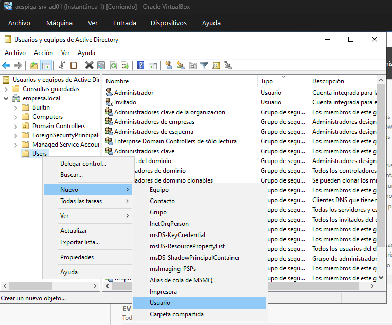  
Hacemos clic derecho sobre usuarios → nuevo → usuario  
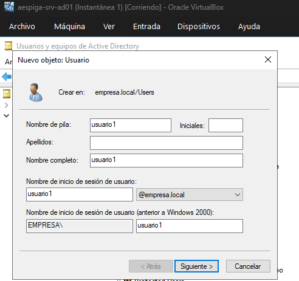  
Introducimos los datos del usuario.  
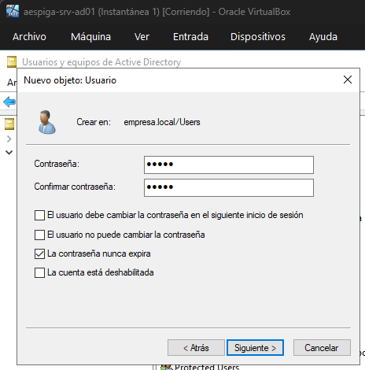  
Elegimos la contraseña y seleccionamos las opciones que nos interesen para este usuario.  
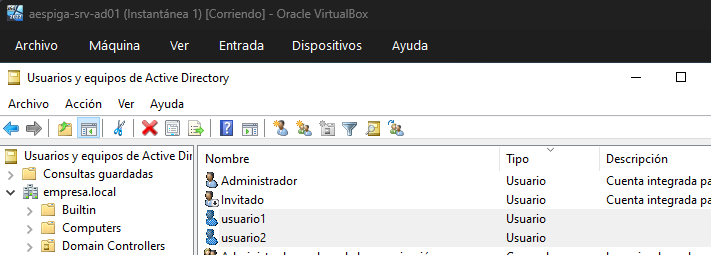  
Hacemos lo mismo con el segundo usuario.  
Con esto hemos creado dos usuarios del dominio, a diferencia de los usuarios locales, que solo tienen permisos en la máquina en la que se crean, los usuarios de dominio se pueden usar en cualquier máquina que esté dentro del dominio y para la que tengan permiso.  

### **6\. Preparación de la carpeta de perfiles móviles**

**En el servidor crea la carpeta: C:\perfiles**  
**Comparte la carpeta con el nombre: perfiles**  
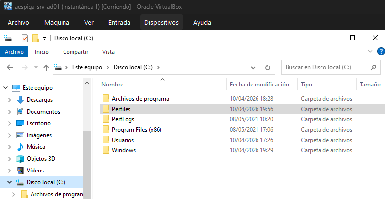  
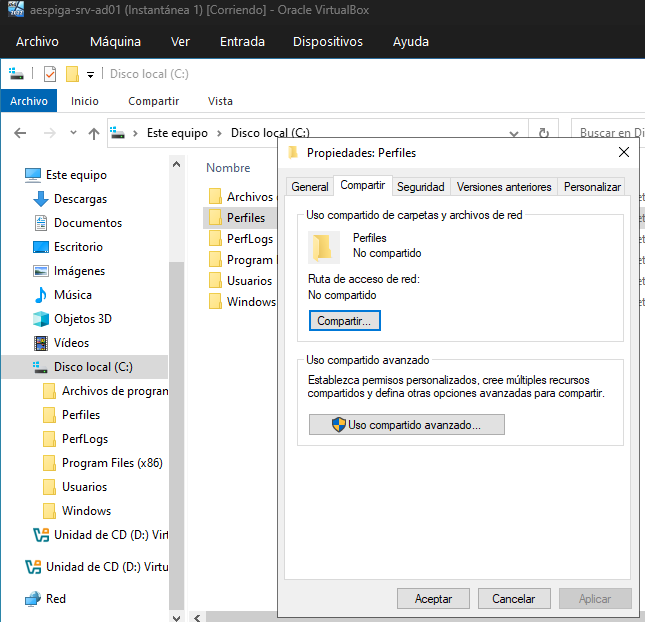  
Una vez creada la carpeta, seleccionamos las propiedades y le damos a compartir  
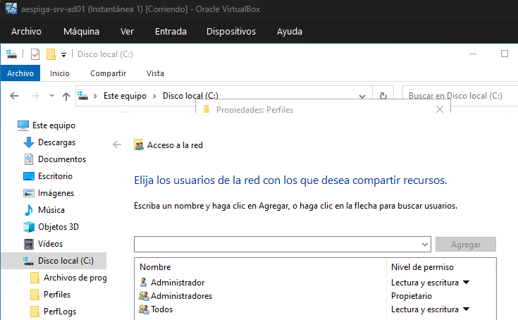  
Agregamos a todos los usuarios escribiendo Todos y les asignamos permisos de lectura y escritura.  
Esta carpeta servirá para almacenar de forma centralizada los perfiles de usuario (escritorio, documentos, configuración), permitiendo que los datos viajen con el usuario. [Documentación oficial](https://support.microsoft.com/es-es/windows/uso-compartido-de-archivos-a-trav%C3%A9s-de-una-red-en-windows-b58704b2-f53a-4b82-7bc1-80f9994725bf).  

### **7\. Configuración de perfiles móviles**

**En Active Directory Users and Computers: Edita las propiedades de cada usuario.**  
**En la pestaña Profile, configura la ruta del perfil: \\srv-ad01\perfiles\%username%**  
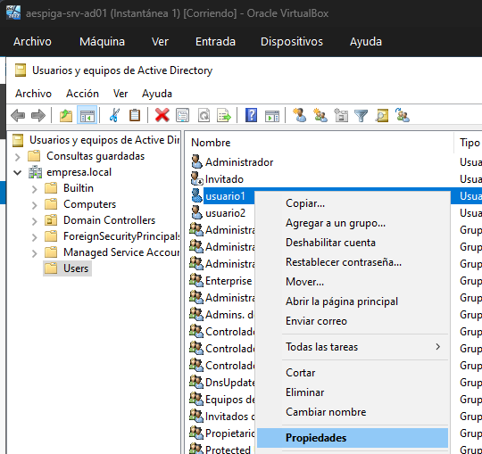  
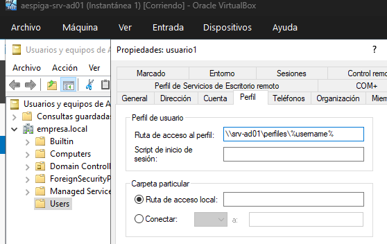  
Una vez abiertas las propiedades, seleccionamos la pestaña perfil y le ponemos la ruta de acceso al perfil (esto lo hacemos con los 2 usuarios)  
Un perfil móvil es una configuración de usuario almacenada en el servidor, gracias a esto, cualquier usuario podrá iniciar sesión en cualquier equipo del dominio y encontrar siempre su entorno de trabajo idéntico. [Documentación oficial](https://support.microsoft.com/es-es/windows/uso-compartido-de-archivos-a-trav%C3%A9s-de-una-red-en-windows-b58704b2-f53a-4b82-7bc1-80f9994725bf).  

### **8\. Unión del equipo Windows 11 al dominio**

**En el equipo cliente cli01: Abre la configuración del sistema.**  
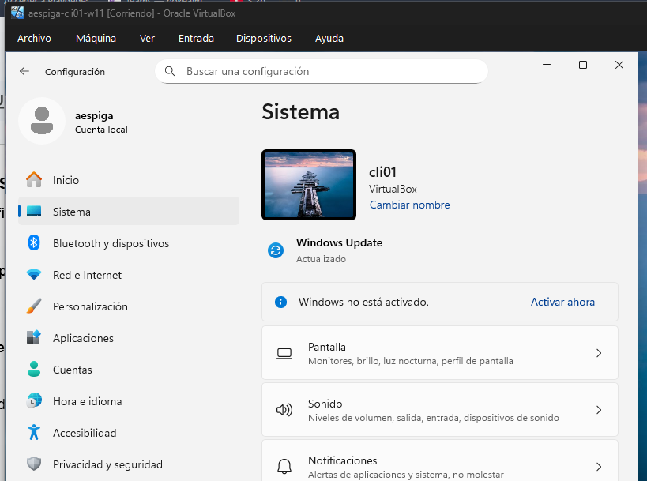  
**Cambia el tipo de red para unir el equipo al dominio:**  
**Dominio: empresa.local**  
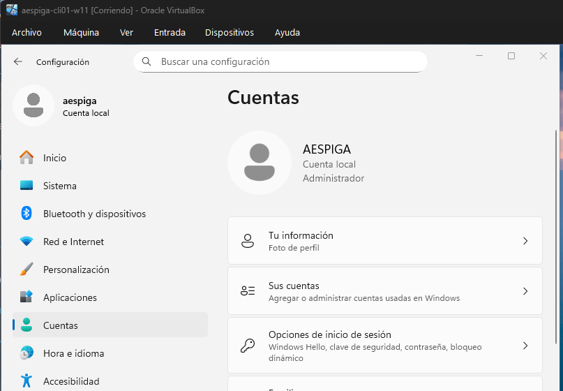  
En la configuración seleccionamos cuentas.  
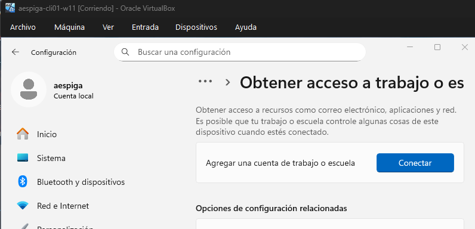  
En cuentas seleccionamos Obtener acceso a trabajo o escuela y le damos a conectar.  
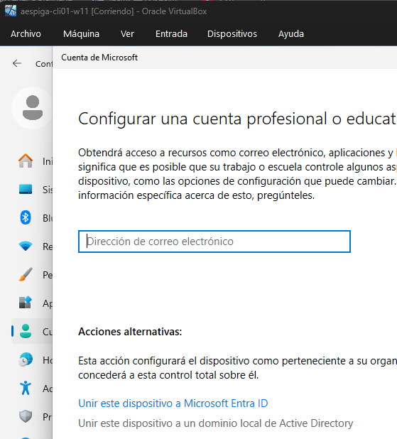  
En esta ventana seleccionamos Unir este dispositivo a un dominio local de Active Directory  
**Cuando se solicite, introduce las credenciales de administrador del dominio.**  
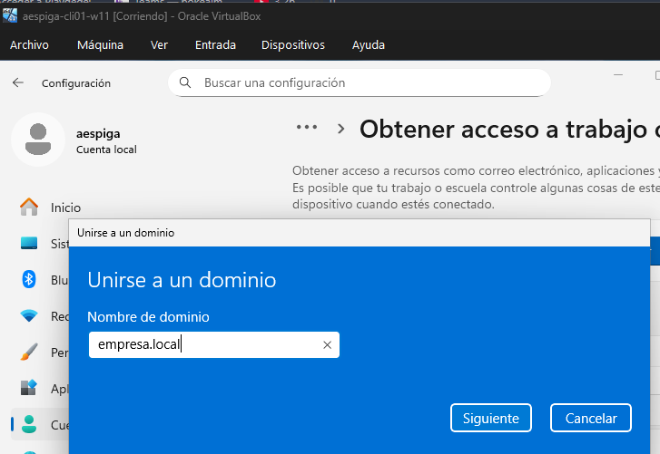  
Introducimos el nombre del dominio.  
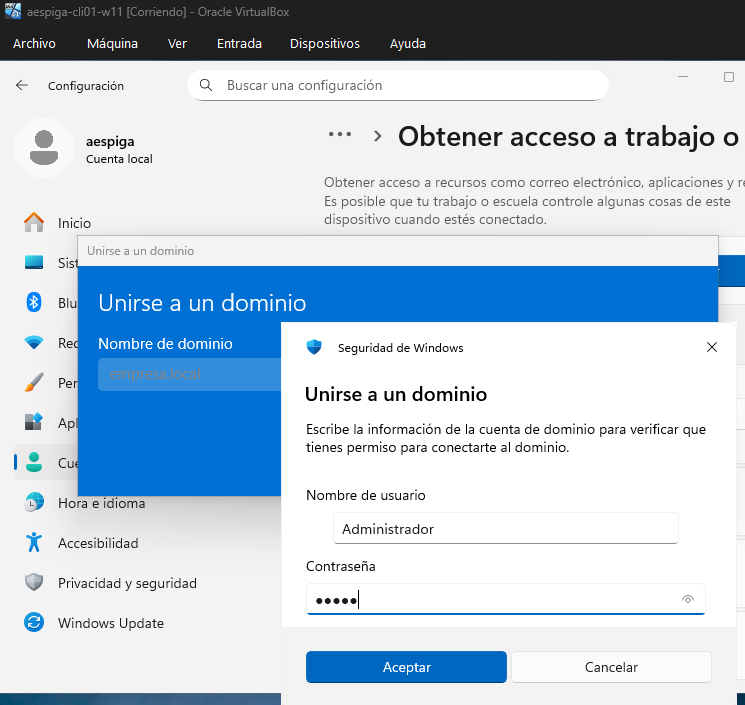  
Introducimos los datos del administrador y reiniciamos el sistema.  
Con esto hemos unido el equipo al dominio y a partir de ahora podremos iniciar sesion en este equipo con usuarios del dominio. [Documentación oficial](https://learn.microsoft.com/en-us/windows-server/identity/ad-ds/manage/join-computer-to-domain?tabs=cmd&pivots=windows-client-11#join-a-device-to-a-domain).  

### **9\. Inicio de sesión con usuarios de dominio**

**En el cliente Windows 11 inicia sesión con: empresa\usuario1**  
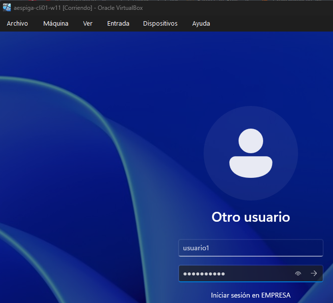  

**Tras iniciar sesión, cierra la sesión y vuelve a iniciarla con: empresa\usuario2**  
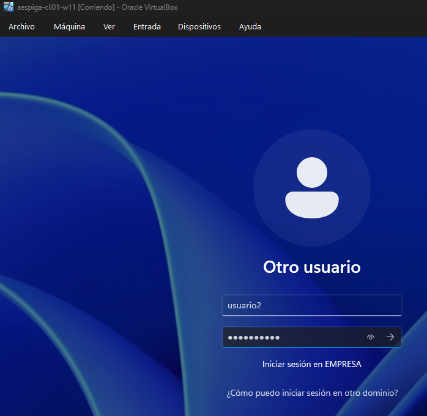  
**Comprueba que en el servidor se crean las carpetas de perfil dentro del recurso compartido.**  
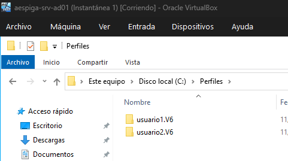  
Efectivamente en la carpeta perfiles del servidor se han creado las carpetas de los perfiles móviles de usuario1 y usuario2. Esto permite que cuando iniciemos sesión desde cualquier ordenador que pertenezca al dominio los usuarios descargarán de estas carpetas sus preferencias y tendrán siempre el mismo entorno. [Documentación oficial](https://learn.microsoft.com/en-us/windows-server/identity/ad-ds/manage/join-computer-to-domain?tabs=cmd&pivots=windows-client-11#join-a-device-to-a-domain).  

### **10\. Modificación de la política de contraseñas**

**En el servidor abre la herramienta: Group Policy Management**  
**Localiza la política: Default Domain Policy**  
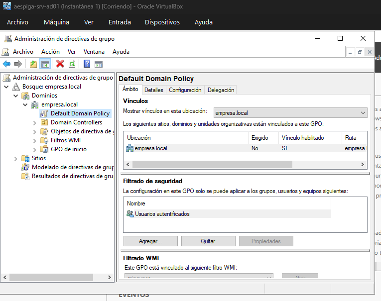  
Una vez abierta la herramienta Group Policy Management, seleccionamos → Bosque → Dominios → empresa.local → Default Domain Policy.  
**Edita la política y modifica alguno de los parámetros de contraseña**  
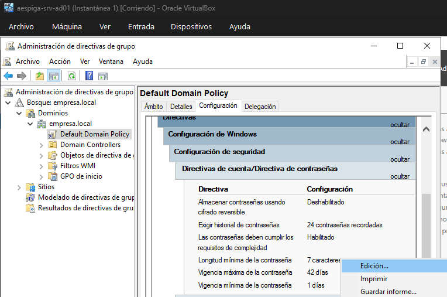  
En la pestaña configuración seleccionamos editar.  
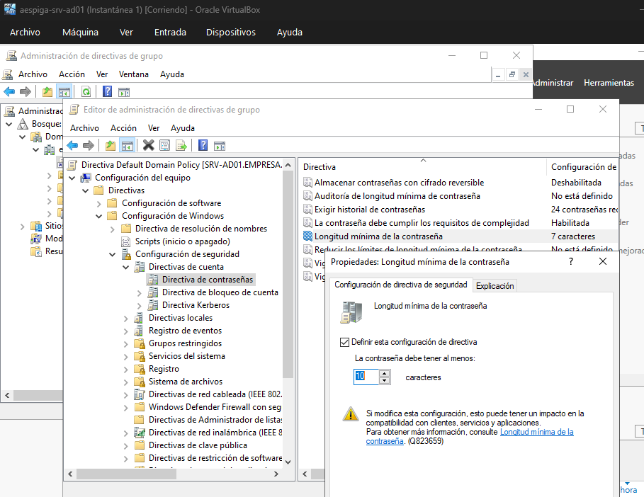  
Editamos la política de contraseñas para que tenga una longitud mínima de 10 caracteres.  
Las Group Policy Objects son contenedores de configuraciones que nos permiten gestionar de forma centralizada el comportamiento de usuarios y equipos en un dominio. Su función principal es aplicar reglas de seguridad y restricciones de software. [Documentación oficial](https://learn.microsoft.com/en-us/previous-versions/windows/desktop/policy/group-policy-objects).  

### **11\. Verificación de la política aplicada**

**En el cliente ejecuta: gpupdate /force**  
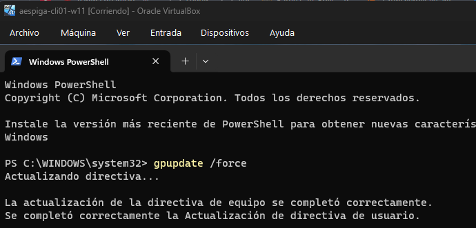  
En la consola del cliente ejecutamos este comando para aplicar los cambios en las políticas.  
**Después intenta cambiar la contraseña de uno de los usuarios para comprobar que se aplica la nueva política.**  
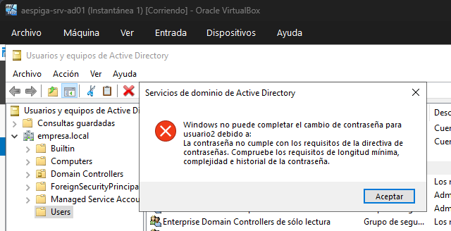  
He intentado cambiar la contraseña del usuario2 a una de 9 caracteres.  
Las políticas se aplican mediante un proceso de replicación y actualización automática donde el equipo cliente descarga y ejecuta las configuraciones del servidor al iniciar sesión o en intervalos periódicos. [Documentación oficial](https://learn.microsoft.com/en-us/previous-versions/windows/desktop/policy/group-policy-objects).  

### **12\. Comprobación final del dominio**

**Comprueba que: el equipo cli01 pertenece al dominio**  
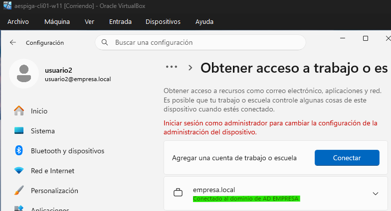  
**los usuarios pueden iniciar sesión en el dominio**  
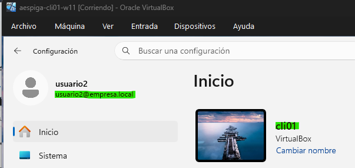  
**los perfiles móviles se almacenan en el servidor**  
  
**la política de contraseñas se aplica correctamente**  
  
En resumen los pasos que hemos dado han sido: hemos creado un controlador de dominio de active directory en la máquina servidor, hemos creado un dominio al que hemos llamado empresa.local y hemos creado dos usuarios en ese dominio, usuario1 y usuario2, además hemos creado un almacén para los perfiles móviles de usuario en la ruta c:\perfiles del servidor. Después hemos añadido la máquina cliente al dominio e iniciado sesión en esa máquina con los usuarios.
