### **1\. Identificación de interfaces de red**

**En cada máquina, muestra las interfaces de red disponibles ejecutando: `ip a`**

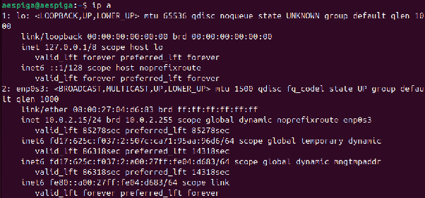

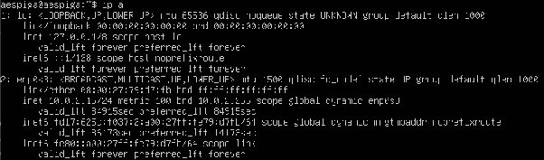

El comando ip a muestra la configuración de red del sistema. [Documentación oficial](https://man7.org/linux/man-pages/man8/ip.8.html)  
En la salida aparecen dos interfaces principales, lo (loopback) que es la interfaz interna del sistema y enp0s3 que es la interfaz de red principal (la tarjeta de red).

**¿Qué interfaz de red está activa?**  
Cliente: La interfaz activa es enp0s3, ya que aparece con el estado UP.  
Servidor: La interfaz activa es enp0s3.

**¿Qué dirección IP tiene asignada actualmente?**  
Cliente: La dirección IP es 10.0.2.15/24.  
Servidor: La IP es 10.0.2.15/24.

**¿Qué dirección MAC tiene la interfaz?**  
Cliente: La dirección MAC es 08:00:27:79:d7:fb  
Servidor: La MAC es 08:00:27:79:d7:fb.

**¿A qué red pertenece la dirección IP?**  
Cliente:Pertenece a la red 10.0.2.0/24.  
Servidor: Pertenece a la red 10.0.2.0/24.

**2\. Identificación de la configuración de red**

**Muestra nuevamente la configuración IP: ip addr**  
**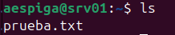**  
**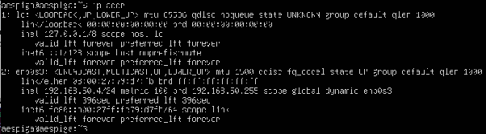**  
ip addr es lo mismo que ip a.

**Muestra la tabla de rutas del sistema: ip route**  
**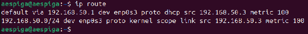**  
**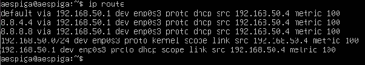**  
Default indica que esta es la ruta por defecto, via se refiere a cual va a ser el próximo salto en envíos unicast, dev es la interfaz de red que se está usando, src 192.168.50.3 .4 es la IP de la máquina, metric 100 es la prioridad de la ruta a menor número mayor prioridad. [Documentación oficial.](https://man7.org/linux/man-pages/man8/ip-route.8.html)  
**¿Qué red local aparece configurada?**  
La red local es 192.168.50.0/24.

**¿Qué interfaz se utiliza para acceder a esa red?**  
La interfaz es enp0s3.

**¿Existe una puerta de enlace configurada?**  
Sí, la puerta de enlace es 192.168.50.1, ya que aparece en la línea default via.

**3\. Configuración del nombre de host**

**Consulta el nombre actual del sistema ejecutando: hostname**  
**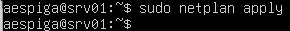**  
**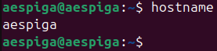**  
El comando hostname nos da el nombre de la máquina, e indica su identificador en la red.

**Servidor: sudo hostnamectl set-hostname srv01**  
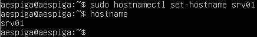

**Cliente: sudo hostnamectl set-hostname cli01**  
**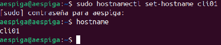**

El comando hostnamectl con el parámetro set-hostname establece un nuevo nombre para la máquina. [Documentación oficial](https://man7.org/linux/man-pages/man1/hostnamectl.1.html).  
**4\. Configuración de dirección IP estática**

**Edita el archivo de configuración de red: sudo nano /etc/netplan/01-netcfg.yaml**  
**Configura las direcciones IP según el esquema definido en el escenario.**  
**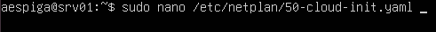**  
En ubuntu server 24 el fichero yaml se llama 50-cloud-init.yaml  
**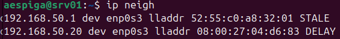**  
He editado el fichero para poner la IP indicada y su ruta de enlace.

**Aplica la configuración: sudo netplan apply**  
****  
Aplico el fichero para que el sistema reconozca los cambios. [Documentación oficial](https://netplan.io/).

**Comprueba la configuración: ip a**  
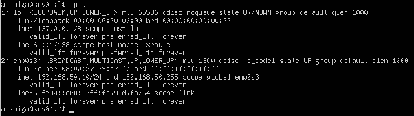  
Se ha aplicado correctamente.  
Ahora voy a hacer lo mismo con el cliente.  
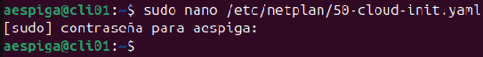  
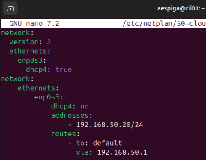  
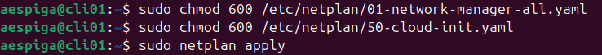  
He necesitado darle permisos a estos 2 ficheros para que se apliquen los cambios.

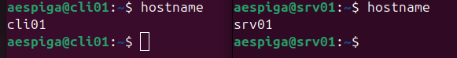

**5\. Verificación de conectividad entre máquinas**  
**Desde el cliente ejecuta: ping 192.168.50.10**  
**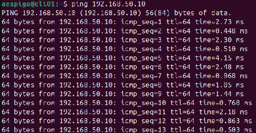**  
Este comando envía paquetes de 64 bytes a la dirección especificada, se utiliza para saber que hay conectividad IP con esa dirección. [Documentación oficial](https://manpages.ubuntu.com/manpages/focal/man8/ping.8.html).

**Desde el servidor ejecuta:ping 192.168.50.20**  
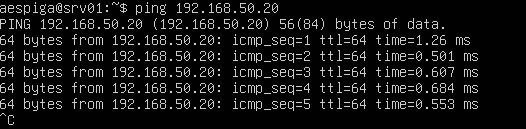  
El ping funciona perfectamente.

**¿Se reciben respuestas del otro equipo?**  
Sí.

**¿Cuántos paquetes se envían y reciben?**  
Infinitos hasta que lo pare o especifique en el comando cuántos paquetes quiero enviar.

**¿Qué información muestra el comando ping?**  
El tamaño del paquete, la dirección de origen, el número de la secuencia y el protocolo (icmp), el ttl es el tiempo de vida del paquete y el tiempo que tarda en llegar paquete.  
**6\. Configuración de resolución de nombres local**  
**Edita el archivo: sudo nano /etc/hosts**  
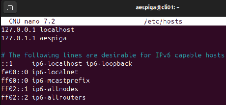

**Añade las entradas:**  
**192.168.50.10 srv01**  
**192.168.50.20 cli01**  
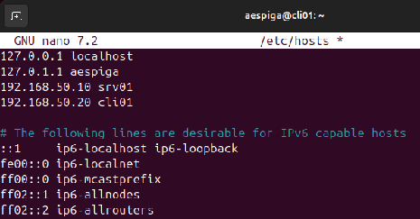

**Comprueba la resolución de nombres:**  
**ping srv01**  
**ping cli01**  
**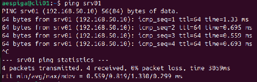**  
Ahora voy hacer lo mismo en el servidor  
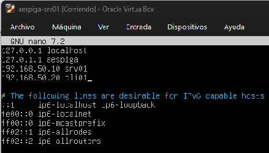  
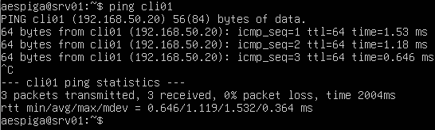  
En el archivo hosts se listan los nombres de máquina y dominio con su IP asociada, cuando queremos acceder a uno de estos nombres linux busca en este archivo para ver si está definida la correspondencia nombre IP. Si lo está ya sabe a qué IP dirigirse, sino consulta a los servidores de nombres de dominios que tenga configurados. [Documentación oficial](https://manpages.ubuntu.com/manpages/trusty/man5/hosts.5.html).

**7\. Análisis de rutas de red**  
**Muestra la tabla de rutas del sistema: ip route**  
**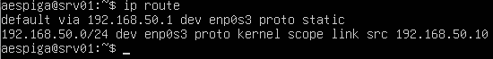**  
****

**¿Qué red aparece en la tabla de rutas?**  
La red local es 192.168.50.0/24.

**¿Qué interfaz se utiliza para acceder a esa red?**  
La interfaz enp0s3.

**¿Qué significa cada columna mostrada en la tabla?**  
Default indica que esta es la ruta por defecto, via se refiere a cual va a ser el próximo salto en envíos unicast, dev es la interfaz de red que se está usando, src 192.168.50.3 .4 es la IP de la máquina, metric 100 es la prioridad de la ruta a menor número mayor prioridad. [Documentación oficial](https://man7.org/linux/man-pages/man8/ip-route.8.html).

**8\. Identificación de puertos y servicios activos**  
**Muestra los puertos abiertos en el sistema: ss \-tuln**  
**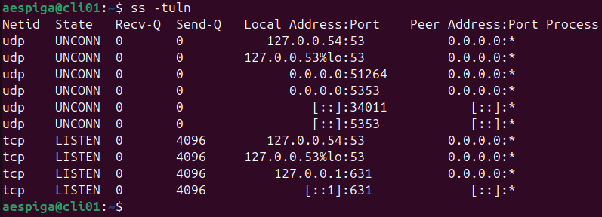**  
**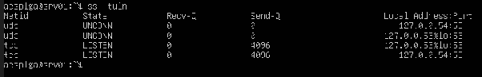**  
El comando ss se utiliza para investigar qué está pasando con las conexiones de red de la máquina. Cuando ejecutas el comando estás pidiendo ver exactamente qué servicios están utilizando conexiones en tu equipo. [Documentación oficial](https://manpages.ubuntu.com/manpages/focal/man8/ss.8.html)

**¿Qué puertos aparecen abiertos?**  
En el cliente: 53, 5353, 631, 51264, 34011\.  
En el servidor: 53\.

**¿Qué significa cada columna mostrada en la salida del comando?**  
**Netid**: el tipo de protocolo, **State**: el estado del puerto LISTEN significa que espera conexiones UNCONN que no está conectado, **Recv-Q**: cantidad de datos recibidos que están en la cola para ser procesados, **Send-Q**: cantidad de datos enviados esperando ser aceptados por el receptor, **Local Address:Port**: la dirección IP de tu máquina y el puerto donde el servicio está conectado y **Peer Address:Port**: la dirección remota.

**¿Qué protocolos se están utilizando?**  
TCP y UDP.  
**9\. Instalación y configuración del servicio SSH**  
**En el servidor ejecuta:**   
**sudo apt update**  
**sudo apt install openssh-server**  
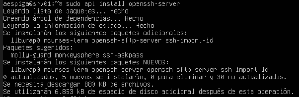

**Comprueba el estado del servicio: sudo systemctl status ssh**  
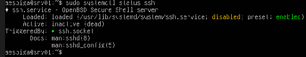  
El servicio está instalado pero detenido, se activará cuando se intente una conexión pero como el siguiente comando es comprobar si el puerto está abierto voy a activar el servicio usando el comando:  
sudo systemctl enable ssh  
sudo systemctl start ssh  
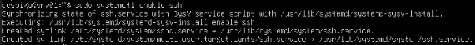  
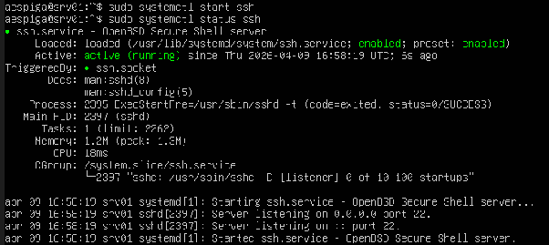

**Comprueba que el puerto está abierto: ss \-tuln**  
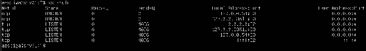  
El servicio ssh está corriendo en el puerto 22\.

**10\. Acceso remoto al servidor**  
**Desde cli01, establece una conexión SSH con el servidor: ssh usuario@192.168.50.10**  
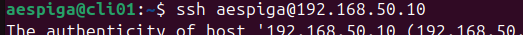  
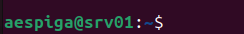

**Una vez conectado ejecuta:**  
**whoami**  
**hostname**  
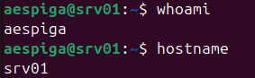  
He conectado desde la máquina cli01 al servidor el terminal ssh usando el usuario aespiga. A partir de este momento los comandos de esta terminal se ejecutan en el servidor.  
[Documentación oficial](https://manpages.ubuntu.com/manpages/noble/man1/ssh.1.html).

**11\. Análisis del estado de las interfaces**  
**Muestra el estado de las interfaces ejecutando: ip link**  
**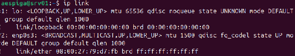**  
**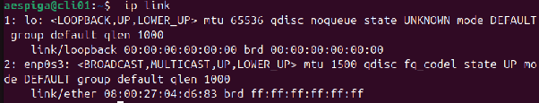**  
Este comando sirve para mostrar el estado de las interfaces de red físicas o virtuales del sistema. Se utiliza principalmente para verificar si una tarjeta de red está activada o desactivada. [Documentación oficial](https://manpages.ubuntu.com/manpages/focal/man8/ip-link.8.html).

**¿Qué interfaces aparecen en el sistema?**  
El bucle local y la interfaz enp0s3

**¿Qué estado tiene cada una (UP, DOWN)?**  
Up en ambas máquinas.

**12\. Consulta de la tabla ARP**  
**Muestra las entradas de la tabla ARP ejecutando: ip neigh**  
  
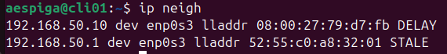  
Este comando muestra las direcciones IP de la red local y su respectiva MAC.   
[Documentación oficial](https://manpages.ubuntu.com/manpages/jammy/man8/ip-neighbour.8.html).

**¿Qué dirección IP aparece asociada a la otra máquina?**  
En el cliente aparece la dirección del servidor y viceversa, además de en ambos casos aparecer la dirección de la puerta de enlace.

**¿Qué dirección MAC tiene?**  
192.168.50.20 → 08:00:27:04:d6:83  
192.168.50.10 → 08:00:27:79:d7:fb

**13\. Transferencia de archivos entre máquinas**  
**Desde el cliente crea un archivo: nano prueba.txt**  
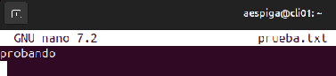

**Copia el archivo al servidor utilizando: scp prueba.txt usuario@192.168.50.10:/home/usuario**  
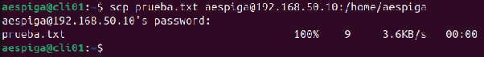  
scp funciona enviando archivos a través de un túnel cifrado por SSH, garantizando que los datos viajen de forma segura entre equipos. [Documentación oficial](https://help.ubuntu.com/community/SSH/TransferFiles).

**Comprueba en el servidor que el archivo se ha copiado correctamente.**  
  
**14\. Gestión del servicio SSH**  
**En el servidor ejecuta: sudo systemctl stop ssh**  
**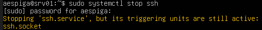**

**Comprueba si el puerto sigue abierto: ss \-tuln**  
**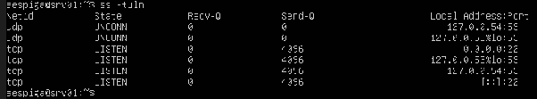**  
Los puertos siguen abiertos porque aunque el servicio se ha detenido sigue estando habilitado y tiene el arranque por trigger activado, es decir, cuando detecte una conexión entrante volverá a arrancar el servicio.

**Intenta conectarte desde el cliente.**  
**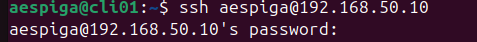**  
**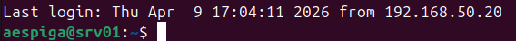**  
Esto confirma que cuando el servidor ha detectado el intento de conexión ha vuelto a levantar el servicio.

**Después vuelve a iniciar el servicio: sudo systemctl start ssh**  
Esto no es necesario ya que nuestro intento de conexión ha vuelto a levantar el servicio.  
  
[Documentación oficial](https://manpages.ubuntu.com/manpages/bionic/man1/systemctl.1.html).  
**15\. Reinicio y comprobación de persistencia**  
**Reinicia ambas máquinas.**   
**La dirección IP sigue configurada correctamente**  
**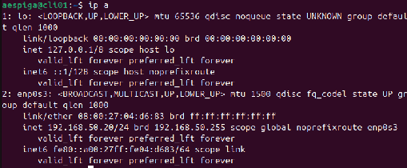**  
**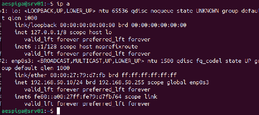**  
Sí, en ambos casos la dirección IP se ha mantenido.  
La IP se mantiene porque al arrancar la máquina lee del fichero yaml la configuración de red

**el hostname se mantiene**  
****  
El nombre de host también se ha mantenido.  
El hostname es persistente entre reinicios porque linux lee el fichero /etc/hostname al arrancar.

**el servicio SSH se inicia automáticamente**  
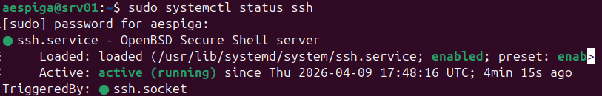  
Como se ve, el servicio está enabled y activo.  
El servicio SSH permanece entre reinicios porque Linux lee al arrancar el fichero /etc/ssh/sshd\_config.
